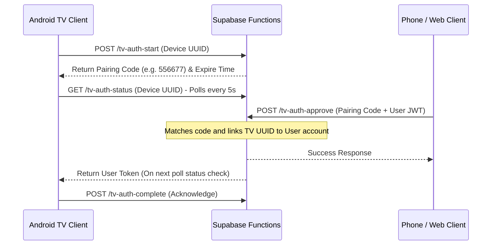

# Supabase Edge Functions API Documentation

This guide describes the API contracts, request payloads, and response models for the Supabase Edge Functions under the `supabase/functions/` directory.

---

## 1. Metadata API Proxies

These functions act as secure relays between the client applications and external metadata providers.

### A. TMDB Proxy (`/functions/tmdb-proxy`)
- **Purpose:** Fetches metadata, posters, and details from TMDB without shipping API keys in the client.
- **Request Headers:**
  - `Authorization: Bearer <user_jwt>` (Requires client authentication)
- **Parameters:** Relays normal TMDB query params (e.g. `/movie/{id}`, `/search/multi`).

### B. Trakt Proxy (`/functions/trakt-proxy`)
- **Purpose:** Coordinates profile-isolated Trakt authentication and synchronizes watchlists.
- **Request Headers:**
  - `Authorization: Bearer <user_jwt>`
- **Parameters:** Passes access code parameters and redirects to oauth login.

---

## 2. TV Code Pairing Authentication Flow

Because typing emails and passwords is slow on TVs, ARVIO implements a numeric pairing code authentication flow.



### Endpoints Details

#### 1. TV Auth Start (`/functions/tv-auth-start`)
- **Method:** `POST`
- **Payload:**
  ```json
  {
    "device_id": "unique-tv-uuid-12345",
    "device_name": "Living Room Android TV"
  }
  ```
- **Response:**
  ```json
  {
    "pairing_code": "489211",
    "expires_at": "2026-06-02T14:30:00Z"
  }
  ```

#### 2. TV Auth Status (`/functions/tv-auth-status`)
- **Method:** `GET`
- **Query Parameters:** `?device_id=unique-tv-uuid-12345`
- **Response (Pending approval):**
  ```json
  {
    "status": "pending"
  }
  ```
- **Response (Approved):**
  ```json
  {
    "status": "approved",
    "access_token": "eyJhbGciOiJIUzI1NiIsIn...",
    "refresh_token": "ref-tok-abc12345"
  }
  ```

#### 3. TV Auth Approve (`/functions/tv-auth-approve`)
- **Method:** `POST`
- **Request Headers:** `Authorization: Bearer <logged_in_web_jwt>`
- **Payload:**
  ```json
  {
    "pairing_code": "489211"
  }
  ```
- **Response:**
  ```json
  {
    "status": "success",
    "message": "Device successfully authenticated"
  }
  ```

#### 4. TV Auth Complete (`/functions/tv-auth-complete`)
- **Method:** `POST`
- **Payload:**
  ```json
  {
    "device_id": "unique-tv-uuid-12345"
  }
  ```
- **Response:**
  ```json
  {
    "status": "acknowledged"
  }
  ```

---

## 3. Cloud Auth & Email Handlers

These edge functions manage email validation and credential recoveries.

- **`cloud-auth-email`:** Triggers transactional verification links on registration.
- **`cloud-auth-reset`:** Triggers password recovery links.

---

## 4. App Usage Events (`/functions/app-usage-event`)

Provides simple analytics to help prioritize developer effort on popular device classes.

- **Method:** `POST`
- **Request Headers:** `Authorization: Bearer <user_jwt>`
- **Payload:**
  ```json
  {
    "event_type": "app_launch",
    "device_class": "tv",
    "os_version": "Android 12 (API 31)",
    "app_version": "1.9.94"
  }
  ```
- **Response:**
  ```json
  {
    "status": "logged"
  }
  ```

---

## 📖 Documentation Navigation

- [README.md](file:///Users/durgaprasadml/Documents/ARVIO/README.md) - Main repository overview.
- [CONTRIBUTING.md](file:///Users/durgaprasadml/Documents/ARVIO/CONTRIBUTING.md) - Guidelines for contributing code.
- [CODE_OF_CONDUCT.md](file:///Users/durgaprasadml/Documents/ARVIO/CODE_OF_CONDUCT.md) - Behavior and community guidelines.
- [docs/architecture.md](file:///Users/durgaprasadml/Documents/ARVIO/docs/architecture.md) - System architecture and dependency dataflows.
- [docs/setup.md](file:///Users/durgaprasadml/Documents/ARVIO/docs/setup.md) - Environment installation checklist.
- [docs/development.md](file:///Users/durgaprasadml/Documents/ARVIO/docs/development.md) - Development commands and workflows.
- [docs/configuration.md](file:///Users/durgaprasadml/Documents/ARVIO/docs/configuration.md) - App parameters and credentials reference.
- [docs/api.md](file:///Users/durgaprasadml/Documents/ARVIO/docs/api.md) - Edge Function API proxies documentation (this document).
- [docs/deployment.md](file:///Users/durgaprasadml/Documents/ARVIO/docs/deployment.md) - CI/CD pipeline automation and TestFlight uploads.
- [docs/troubleshooting.md](file:///Users/durgaprasadml/Documents/ARVIO/docs/troubleshooting.md) - Common problems and resolution guide.
- [docs/ios-testflight.md](file:///Users/durgaprasadml/Documents/ARVIO/docs/ios-testflight.md) - iOS App Store/TestFlight packaging instructions.
