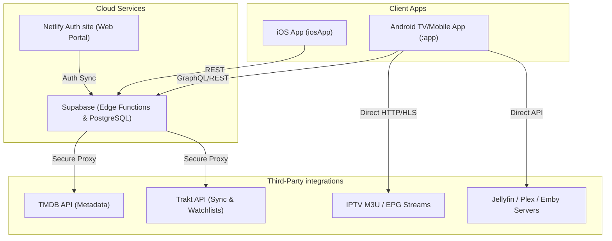
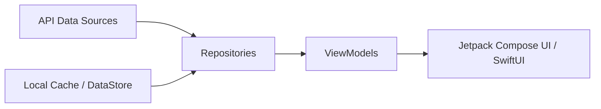

# ARVIO Architecture Documentation

This document describes the high-level architecture, module breakdown, internal dependency flows, data lifecycles, and backend integrations of the ARVIO codebase.

---

## 1. High-Level System Overview

ARVIO is structured as a decoupled multi-platform project with a shared backend service layer. 

---

## 2. Core Android Modules & Folder Responsibilities

The primary Android application resides inside the `app/src/main/kotlin/com/arflix/tv/` directory.

### Module Breakdown
- **[ArflixApplication.kt](file:///Users/durgaprasadml/Documents/ARVIO/app/src/main/kotlin/com/arflix/tv/ArflixApplication.kt):** Main application class. Initializes Sentry, Hilt Dependency Injection, and registers WorkManager periodic sync workers.
- **[MainActivity.kt](file:///Users/durgaprasadml/Documents/ARVIO/app/src/main/kotlin/com/arflix/tv/MainActivity.kt):** Single entry point activity. Sets up the Compose content tree, handles deep links, and manages fullscreen system UI visibility.
- **`ui/`:** Implements UI components and screens. Includes `theme/` definitions, custom components (e.g. `Sidebar.kt`, `MediaCard.kt`), and features grouped by page flow (home, search, tv, player).
- **`data/`:** Encapsulates the data access layer:
  - `model/`: Domain models (e.g. `Profile.kt`, `CatalogModels.kt`).
  - `api/`: Retrofit service endpoints (e.g. `TmdbApi.kt`, `TraktApi.kt`).
  - `repository/`: Single source of truth repositories coordinating local cache and remote fetches (e.g. `CloudSyncRepository.kt`, `IptvRepository.kt`).
- **`di/`:** Defines Hilt Dependency Injection modules for providing singleton network, database, and repository instances.
- **`navigation/`:** Manages Compose Navigation graph mapping destinations (Home, TV, Player, Settings) and passing route arguments.
- **`network/`:** Network monitors and interceptors (e.g. `ApiProxyInterceptor.kt`) that append tokens or rewrite URLs for Supabase proxies.
- **`updater/`:** Controls sideload app updates, including APK downloading, file provider sharing, and triggering package installers.
- **`util/`:** Core utility files, including frame-rate matching helpers, subtitle scoring logic, and logging systems.
- **`worker/`:** Background services using Android WorkManager for scheduling period tasks.

---

## 3. iOS SwiftUI Shell Architecture

The additive iOS target resides under `iosApp/`:
- **[ARVIOApp.swift](file:///Users/durgaprasadml/Documents/ARVIO/iosApp/ARVIO/ARVIOApp.swift):** Entry point of the application.
- **`AuthService.swift` / `CloudSyncService.swift`:** Swift clients that consume Supabase REST endpoints for profile restoration and settings sync.
- **`AddonService.swift`:** Manages addon discovery and resolves stream URLs.
- **`HomeView.swift` / `SettingsView.swift`:** SwiftUI views rendering reactive lists.

---

## 4. Internal Dependency Flow

Data flows reactive-style from database sources up to the UI components.

1. **API & Local Cache:** Repositories combine API calls with local SQLite or DataStore preferences.
2. **State Sharing:** Repositories publish Kotlin `Flow`s representing loading, success, or error states.
3. **ViewModel Consumption:** ViewModels collect flows, apply map transformations, and expose state.
4. **Reactive UI:** Compositions collect ViewModel state (using `collectAsStateWithLifecycle`) to trigger recomposition when the data updates.

---

## 5. Configuration & Sync Lifecycles

### Local Storage & Settings
Local settings are stored using Jetpack DataStore Preferences in [DataStores.kt](file:///Users/durgaprasadml/Documents/ARVIO/app/src/main/kotlin/com/arflix/tv/util/DataStores.kt). This includes subtitle defaults, display layout selections, active profiles, and DNS parameters.

### Cloud Synchronization Flow
1. **Trigger:** Profile change, app resume, or manual sync trigger in Settings.
2. **Fetch:** [CloudSyncCoordinator.kt](file:///Users/durgaprasadml/Documents/ARVIO/app/src/main/kotlin/com/arflix/tv/data/repository/CloudSyncCoordinator.kt) pulls the latest profile snapshot from Supabase.
3. **Merge:** System compares timestamps and applies incoming updates to local DataStore settings and IPTV favorites.
4. **WebSocket Sync:** When active, [RealtimeSyncManager.kt](file:///Users/durgaprasadml/Documents/ARVIO/app/src/main/kotlin/com/arflix/tv/data/repository/RealtimeSyncManager.kt) maintains a persistent WebSocket connection to broadcast settings updates in real time to other paired devices.

---

## 6. Critical Architectural Utilities

- **[FrameRateUtils.kt](file:///Users/durgaprasadml/Documents/ARVIO/app/src/main/kotlin/com/arflix/tv/util/FrameRateUtils.kt):** Matches the physical TV display rate to the video stream rate to eliminate stuttering during ExoPlayer playback.
- **[SubtitleScoring.kt](file:///Users/durgaprasadml/Documents/ARVIO/app/src/main/kotlin/com/arflix/tv/util/SubtitleScoring.kt):** Scores and ranks available subtitle tracks based on filename keywords (e.g. matching release team) to present the best option first.
- **[OkHttpProvider.kt](file:///Users/durgaprasadml/Documents/ARVIO/app/src/main/kotlin/com/arflix/tv/network/OkHttpProvider.kt):** Builds the standard HTTP client, injecting interceptors for API credentials and setting custom timeouts for streaming feeds.

---

## 📖 Documentation Navigation

- [README.md](file:///Users/durgaprasadml/Documents/ARVIO/README.md) - Main repository overview.
- [CONTRIBUTING.md](file:///Users/durgaprasadml/Documents/ARVIO/CONTRIBUTING.md) - Guidelines for contributing code.
- [CODE_OF_CONDUCT.md](file:///Users/durgaprasadml/Documents/ARVIO/CODE_OF_CONDUCT.md) - Behavior and community guidelines.
- [docs/architecture.md](file:///Users/durgaprasadml/Documents/ARVIO/docs/architecture.md) - System architecture and dependency dataflows (this document).
- [docs/setup.md](file:///Users/durgaprasadml/Documents/ARVIO/docs/setup.md) - Environment installation checklist.
- [docs/development.md](file:///Users/durgaprasadml/Documents/ARVIO/docs/development.md) - Development commands and workflows.
- [docs/configuration.md](file:///Users/durgaprasadml/Documents/ARVIO/docs/configuration.md) - App parameters and credentials reference.
- [docs/api.md](file:///Users/durgaprasadml/Documents/ARVIO/docs/api.md) - Edge Function API proxies documentation.
- [docs/deployment.md](file:///Users/durgaprasadml/Documents/ARVIO/docs/deployment.md) - CI/CD pipeline automation and TestFlight uploads.
- [docs/troubleshooting.md](file:///Users/durgaprasadml/Documents/ARVIO/docs/troubleshooting.md) - Common problems and resolution guide.
- [docs/ios-testflight.md](file:///Users/durgaprasadml/Documents/ARVIO/docs/ios-testflight.md) - iOS App Store/TestFlight packaging instructions.
