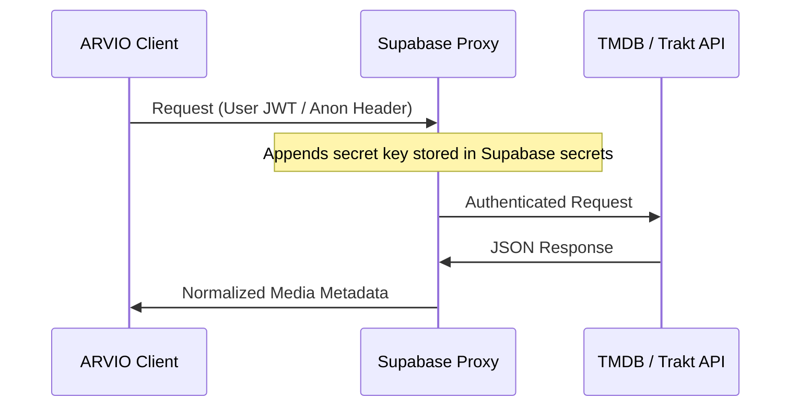

# Configuration and Secrets Guide

This document explains how ARVIO manages secrets, API credentials, and release signing certificates.

---

## 1. Secrets Management Architecture

ARVIO utilizes the **Secrets Gradle Plugin** to load local configuration parameters dynamically.

- **[secrets.defaults.properties](../secrets.defaults.properties):** Checked into Git. Contains default dummy values and placeholder parameters to ensure the project compiles out-of-the-box.
- **`secrets.properties`:** Not checked into Git. Used locally to override defaults with real API tokens and database keys.

When compiling, keys defined in `secrets.properties` are injected by Gradle as fields in `BuildConfig` or reference strings.

---

## 2. API Proxy Routing vs. Direct Keys

To prevent credentials (TMDB / Trakt API keys) from being extracted from client binaries, release builds route metadata calls through Supabase Edge Function proxies.



### Local Direct Configuration (Developer Mode)
If you want to test API features without setting up a full Supabase proxy cluster:
1. Provide TMDB and Trakt keys directly in your local `secrets.properties`:
   ```properties
   TMDB_API_KEY=your_actual_tmdb_key
   TRAKT_CLIENT_ID=your_actual_trakt_id
   TRAKT_CLIENT_SECRET=your_actual_trakt_secret
   ```
2. The app's repository classes will detect these keys and automatically fall back to calling TMDB/Trakt endpoints directly instead of routing through the proxy.

---

## 3. Configuration Fields Reference

Add or modify these values in your local `secrets.properties`:

| Key Name | Purpose | Example / Required Format |
|----------|---------|---------------------------|
| `SUPABASE_URL` | Endpoint URL for profile sync databases. | `https://xzy.supabase.co` |
| `SUPABASE_ANON_KEY` | Public access token for Supabase functions. | `eyJhbGciOiJIUzI1NiIsIn...` |
| `GOOGLE_WEB_CLIENT_ID` | Web Client ID for configuring Google authentication on Android TV. | `123-abc.apps.googleusercontent.com` |
| `SENTRY_DSN` | Destination URL for Sentry logging. | `https://key@sentry.io/project` (Set `disabled` to skip) |

---

## 4. Release Keystore signing Setup

Android release builds require signing configurations.

1. Create a `keystore.properties` in the repository root:
   ```properties
   storeFile=my-release.keystore
   storePassword=keystore_passphrase
   keyAlias=my_signing_alias
   keyPassword=alias_passphrase
   ```
2. Place your keystore file (e.g. `my-release.keystore`) inside the root directory.
3. Gradle will automatically load these properties when running `:app:assemblePlayRelease` or `:app:assembleSideloadRelease`.

### Generating a Keystore (For Testing)
To generate a private keystore key locally:
```bash
keytool -genkey -v -keystore testing-release.keystore -alias testing_alias \
  -keyalg RSA -keysize 2048 -validity 10000
```

## 5. Storage and Cache Management Settings

ARVIO allows users to monitor and clear cache sizes under the **Settings -> System -> Storage** panel.

### Monitored Paths and Data Sources
- **Metadata Database:** Refers to the Room database file (`arvio_cache.db`). The settings panel computes the actual size of the database file on disk.
- **Artwork Cache:** Refers to Coil's image disk cache located at `cacheDir/image_cache/`.

### Available Maintenance Actions
The UI provides D-pad friendly actions to perform cache cleaning:
1. **Clear Database Metadata:** Calls the Room database transaction `cacheDao.clearAllMetadata()` to purge all cached movies, shows, episodes, cast, and reviews without deleting preference data.
2. **Clear Cached Artwork:** Clears Coil's disk cache by invoking the Coil `imageLoader`'s disk cache clear method.
3. **Clear All Cached Data:** Performs both operations in sequence.

The size indicators are dynamically recalculated using a background coroutine upon completing any clear operation.

---

## 📖 Documentation Navigation

- [README.md](../README.md) - Main repository overview.
- [CONTRIBUTING.md](../CONTRIBUTING.md) - Guidelines for contributing code.
- [CODE_OF_CONDUCT.md](../CODE_OF_CONDUCT.md) - Behavior and community guidelines.
- [docs/architecture.md](./architecture.md) - System architecture and dependency dataflows.
- [docs/setup.md](./setup.md) - Environment installation checklist.
- [docs/development.md](./development.md) - Development commands and workflows.
- [docs/configuration.md](./configuration.md) - App parameters and credentials reference (this document).
- [docs/api.md](./api.md) - Edge Function API proxies documentation.
- [docs/deployment.md](./docs/deployment.md) - CI/CD pipeline automation and TestFlight uploads.
- [docs/troubleshooting.md](./troubleshooting.md) - Common problems and resolution guide.
- [docs/ios-testflight.md](./ios-testflight.md) - iOS App Store/TestFlight packaging instructions.
